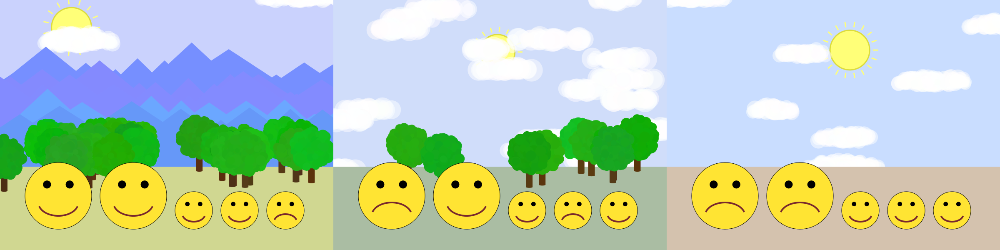

Comp 124: Emoji Family Vacation Lab
====

Your emojis are going on vacation!

Overview
---

You start this lab with an existing project, which gives you some nice building blocks for creating landscapes. You will fill out the landscapes, then put your emojis in them to create a slide show of vacation photos that are similar to the ones above.

Setup
---

1. Fork this repo.
2. Clone your fork of this repo using VCS → Checkout.
3. Import into Intellij using New → Module from Existing. Be sure to choose the `124-emoji-vacation-lab.iml` file.

Tasks
---

1. Look through existing code in the `EmojiVacation` class. Read the method signatures (the top part of each method before the brace that declares its name, return type, and parameters) to understand which methods are available and what they do. You do not need to understand in depth how they are actually _implemented_. You are concerned with their _purpose and behavior_.
2. Run the code and see what it produces. Notice that it draws no mountains or trees. Modify the `createVacation` method to draw mountains 50% of the time and trees 60% of the time.
    - Hint: Look in the class for a method that will help you make something happen a certain percent of the time.
    - Hint: The scene can contain both mountains and trees, or just one, or neither.
3. Copy the methods from your emoji method decomposition activity that you used to draw different emoji into the `EmojiVacation` class.
4. If you defined the parameters to your methods correctly, then you should be able to draw emoji on different parts of your screen just by passing different values to the parameters when calling the methods. If not, modify your methods to make the emoji repositionable.
5. Modify the `createEmoji` method to create one of your emoji faces.
    - Hint: Test placing it at different positions on the screen to make sure you implemented the previous step correctly.
6. Implement the `createFamily` method. This method should create emoji in a line, as in the pictures above, with variable numbers of adults and children based on the parameter values.
    - Hint: Use loops!
    - Hint: Try making just the adults first, then add the children.
    - Also: It is okay if your adults and children are the same size for now.
7. Make your `createEmoji` method randomly select from different emoji, so that each family member has a different expression. For example, in the images above, emojis are frowing 20% of the time and smiling the rest of the time. Look carefully at the existing methods in the class. Some may be helpful.
8. When you run your program, you should now see your emoji family appear with a random background.
9. Modify the `doSlideShow` method to create a slide show of different vacation pictures. This will require creating an infinite loop that calls `createVacation`. In the loop after you have created a vacation image, you should pause the program's execution for three seconds, and then remove all of the graphical objects on the canvas so that the next time through the loop it draws on a blank canvas.
    - Hint: Look carefully at the CanvasWindow documentation for methods to help you do this.

Optional Challenge Tasks
---

1. Adjust your emoji methods to take into account the size parameter. You should be able to make the children smaller than the adults, as in the images above.
2. Make the screen briefly go dark between scenes, to give a “slide projector” effect. (`NO_SLIDE_COLOR` is there to help you with this.)
3. Add buildings or other new scenery that appears with a random chance.
4. Make different times of day. (The moon is hard to draw with comp124graphics, but you could draw stars and change the sky color.)
5. Modify the `createFamily` method to display the adults and children in a random order. Make sure to keep the correct numbers of adults and children!
