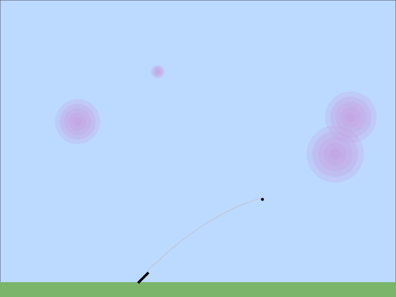
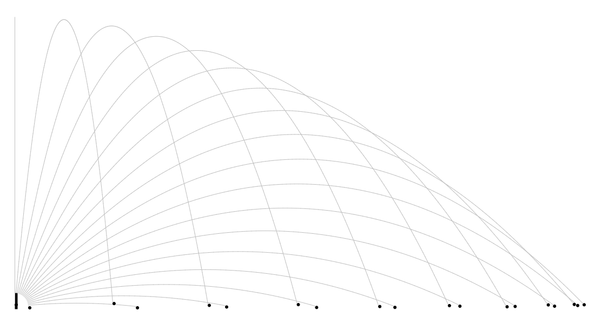

# Homework 2: Bubble Blitz

In this homework, you will practice:

- Decomposing a problem into classes and methods
- Creating animation loops
- Exploring how to write effective tests

Hat tip to Bret Jackson, the original author of this assignment.

## Background Knowledge: Using the `GraphicsGroup` class

The `comp124graphics` package contains a class called `GraphicsGroup` that is a `GraphicsObject`, and can therefore be placed on a canvas using the `add` method — but is also a container for graphics objects, like a canvas, with its _own_ `add` method. This enables several graphical objects that could be placed together or all moved in the same way to be kept together in one object and all moved at once.

One thing to keep in mind with `GraphicsGroup`s is that they define their own interior coordinate system. For example, if you add a `Rectangle` object to the group at position (10, 10) and then add the group to the `CanvasWindow` at position (50, 50), then your rectangle will actually appear at position (60,60) relative to the upper left corner of the window.

## Your Tasks

Your task in this homework is to create an Angry Birds style game where the user can adjust the angle and velocity of a cannon (the black line) to shoot purple bubbles on the screen:

1. Fork and clone the project. Import the code into Intellij as a new module. Remember to choose the `.iml` file, **not the folder**.
2. Explore the code we have given you. We have already decomposed the problem into the following classes:
  - `BubbleBlitz`: A `CanvasWindow` responsible for running the program and holding the other graphical objects.
  - `Cannon`: a `Line` representing the direction the cannon is pointing
  - `CannonBall`: an `Ellipse` representing the cannon ball. Responsible for updating its position when fired.
  - `Bubble`: a `GraphicsGroup` representing a single bubble as a collection of concentric circles. Reponsible for determining if it has been hit by a cannon ball.
  - `BubbleManager`: keeps track of bubbles and is able to query each bubble to see if it should be popped.
  - `VisualCannonTester`: can be used to test that your CannonBall code works correctly. (This is in the test folder with other test code.)
 
### Part 0: Cannon Balls

You should use an iterative development process to avoid writing a lot of untested code that then breaks when you finally run it. Start by working on the `CannonBall` class. Complete a constructor and add instance variables as needed.

Each `CannonBall` object must keep track of the following state:

- the ball’s current center position (x and y),
- the ball’s current velocity (dx and dy), and
- the maximum x and y values for the boundaries outside of which the ball should stop moving.

#### The constructor

`CannonBall` provides an empty constructor. You will need to fill it in.

First call the constructor of the super class. This will make the error that appears on the class signature go away.

Use the parameters to initialize the starting state of the class. There is a comment with a hint about computing the initial velocity.

#### Property accessors

Add getter methods for the center x and center y.

#### `updatePosition`

This method moves the ball if it is still in bounds, then applies gravity by adjusting the ball’s velocity.

Your method should do this:

- Calculate new x and y coordinates by adding the x and y velocities times `dt` to the current coordinates.
- If the new positions are greater than zero and less than the maximum:
  - Move the `CannonBall` to the new position. (Hint: A CannonBall *is* an Ellipse which stores the x and y position. Look at the Ellipse methods for help.)
  - Subtract `GRAVITY` times `dt` from the y velocity.
  - Return true, meaning “in bounds.”
- Otherwise, if the ball is out of bounds:
  - Return false, meaning “out of bounds.”

#### Visual testing

Now visually test your results. Open `VisualCannonTester` in the test folder, and edit line 33 to initialize a `CannonBall` object using the value for the variables defined on the previous few lines. Run the code. You should get an animated result that looks like the following when it is complete:

#### Unit testing

You should also test your code with unit tests. In the test folder, run `CannonBallTest` and make sure that it passes. (The numbers in the test are already correct.) Add new test methods to check that `updatePosition` returns the expected boolean value, and that it does not change the position if the result would put it outside of the specified bounds.

### Part 1: Bubbles

Look at the `Bubble` class. We have completed the constructor and drawing code for you already. Make sure you understand how the positioning of the Ellipses inside the `GraphicsGroup` works. We will be using `GraphicsGroup` objects in future assignments.

Complete the `intersects` method. This should return true if the cannon ball parameter is within the bubble's radius. Otherwise it should return false.

In the test folder, run `BubbleTest`. Its tests should now pass.

### Part 2: Popping Bubbles

Open `BubbleBlitz`. This class contains the main method to run your game to allow a player to shoot cannon balls at the bubbles to pop them. Start by implementing a single round of the game that prompts a user for input and then fires the cannon. A single round progresses as follows:

- Ask the user for an angle between zero and 180 degrees
- Update the cannon to the specified angle
- Ask the user for an initial velocity
- Create a cannonball starting at the cannon’s x2/y2 position with the specified velocity, angle, and boundaries based on the width/height of the window
- Add the cannonball to the canvas
- While the ball does not hit a bubble and is in bounds:
  - Update the ball’s position, passing a dt of 0.1
  - Pause for 10ms
- Remove the cannonball from the canvas

Requirements and hints:

- You must use method decomposition! Make sure not all of the pseudocode above is in one giant method. Give each method one small, clear purpose.
- Look at the documentation for `CanvasWindow` to figure out how to pause and remove objects.
- Look at the `BubbleManager` to determine which method actually calls the bubbles’ `intersects` method.

Run the `BubbleBlitz` program and interactively test that you can shoot a bubble.

Now modify your code so that as long as bubbles still exist on the canvas you can repeatedly keep asking the user for new angles/velocities to shoot again.

Once you can do that, modify your code again so that when all the bubbles have popped the game resets and allows you to play again. If you have practiced good method decomposition, these last two steps should not be too difficult. Hint: the `BubbleManager` can tell you if there are still bubbles left on the screen.

### Optional bonus challenges

Occasionally, our homeworks will list optional extra credit tasks that allow you to go beyond the basic requirements of the assignment. You won't receive a _lot_ of extra credit points for the extra work (If you are doing extra credit, you probably don't need them anyway), but they are fun opportunities to challenge yourself and learn more!
There are many things you could do to go beyond the basics of this assignment:

- Implement a maximum number of shots the user can take before telling them that they lose. Display the current shot count on the screen.
- Add more interesting graphics drawings (e.g. animations of bubbles popping, a more detailed cannon, etc.)
- Implement a count down timer that displays on the screen
- Implement a class to represent obstacles randomly distributed throughout the sky. The obstacles should block the cannon balls, so that the user has to make use of the projectile curves to hit blocked bubbles.
