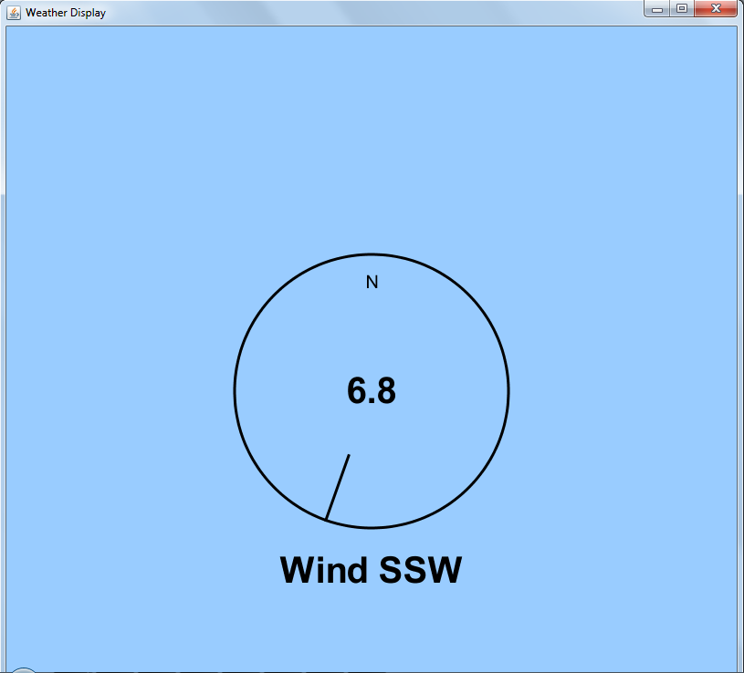
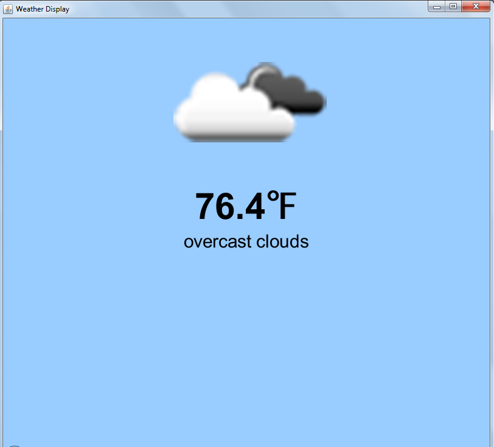
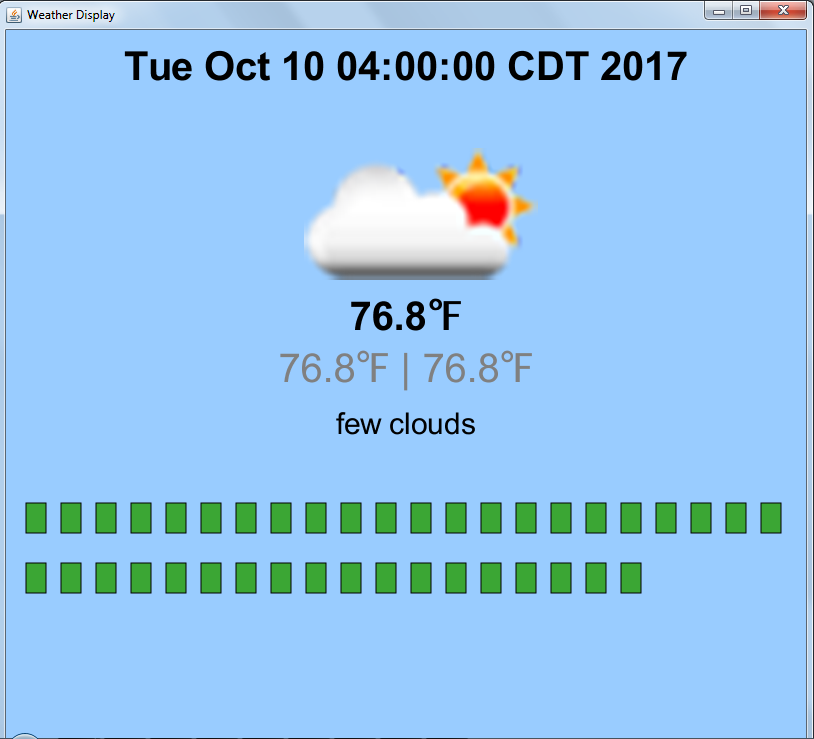
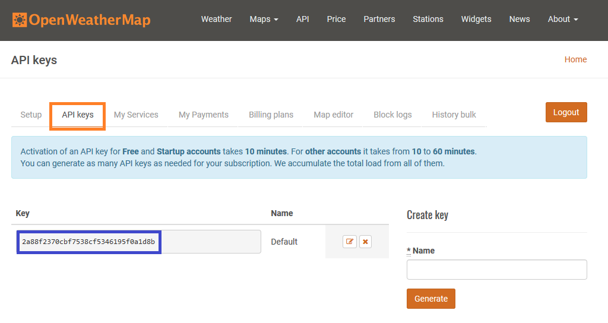

# Homework 3: Weather Display

### Overview

For this assignment, you will be adding to a weather widget interface that we have provided, which will grab current forecast information from openweathermap.org.  We have created a wrapper class to handle accessing and parsing the data from the site, so that you only have to make use of the data.  You will be using arrays and mouse listeners as part of this assignment.  As always, make sure to follow good [Java style practices](https://docs.google.com/a/macalester.edu/document/d/1YpCzhKhYy5JUQ6oCGJZdf92a0jjpmjMxfKfhPkFl5As/edit?usp=sharing). (Note, check the linked file for new code style **requirements** that take effect with this homework.)

The following are three example widget displays that you might implement as part of this assignment.  The first one shows the direction and speed of the wind.  The second one shows the current temperature and weather state.  The third one contains the forecast in 3 hour increments, and displays the details for whichever box the mouse is hovering over.

### Getting an API Key

You will first need to get your own API key, by signing up for a free account on http://openweathermap.org/appid.  OpenWeatherMap provides this API so that people have access to weather data for apps and widgets, such as the ones you'll be making.Once you've completed the sign up page, it will take you to your account setup page.  Select the next tab over from "Setup", which is the "API keys" tab (location boxed in orange).  You have a default API key already, so copy that (location boxed in blue, do not use the one in the image).

Now open the WeatherProgram file in IntelliJ.  At the top, you will see a TODO asking you to fill in your API key.  Remove the placeholder String ("123"), and replace it with your own API key (as a String).  Rembember to remove the TODO when you've completed the task.

### Task 1: Current Weather Display Widgets

For this part of the assignment, you need to make **two** different basic weather display classes, each of which is a subclass of the abstract WeatherWidget class. (These do not need to match the examples provided above). Each class should show information about the current conditions (and only the current conditions), such as the wind and temperature images shown above.  You do not need to implement wind and temperature specifically, feel free to be creative in choosing what you want to display about the current weather conditions.  However, your two displays must show different information about the current conditions. As a rule of thumb, each widget should show at least two unique pices of information to be considered "different enough" for full credit.

Take a look at SimpleWidgetExample to see how to set up your own widget classes.  In particular, the example shows you how to create a weather connection (through a OpenWeatherConnection object) in the constructor, and how to initialize the widget.  Make sure that you are passing an OpenWeatherConnection object to your widget and then passing that object on to the superclass, not making a new one.  You should only make one OpenWeatherConnection object for the entire program, and that is already done for you in the WeatherProgram constructor.  That object is then passed to each of the widgets in use.  This reduces the number of connections you have open, and reduces the number of requests you send (which is regulated for your API key).
 
The SimpleWidgetExample class also has an implemented draw() method.  You will need to include significantly more in your own widget draw() methods.  Do not implement a main() method in your own widget classes.  That will be handled in the WeatherProgram (it is contained within the SimpleWidgetExample so that the example can run by iteself).

Helpful Notes:
* To add text to your widgets, take a look at the GraphicsText javadoc, which is located in 124-shared, under the doc/comp124graphics directory.
* You can change the font size by creating a new font, "Font f = new Font("SanSerif", Font.PLAIN, 20)" and then calling setFont on the corresponding Graphics Text object.  You can get more information through the [Font javadoc](https://docs.oracle.com/javase/8/docs/api/java/awt/Font.html).
* "\u2109" will draw a degrees F symbol
* You can use a decimal formatter to limit the number of decimal places drawn in your text.  You can find an example in the ForecastWidget class.

### Task 2: Adding Widgets to WeatherProgram

Once you have created your new widget classes, you will need to make modifications to the WeatherProgram in order to run things.  You won't need to make test cases for this assignment, but you will have to test that things work by running the WeatherProgram and making sure you get the behavior you expect from the widgets.  In order to do that, you'll need to make the WeatherProgram run your widgets.

You will first need to modify the WeatherProgram to include instance variables for an array of WeatherWidgets and to keep track of the currently displayed index of the array.  Once you have the instance variables, you will need to initialize and populate the array with your widgets.  You'll find TODO notes in the class with further information about what and where to implement these items.  Run the program and make sure your first widget in the array displays as you expected.

We want to see all of the widgets available in the WeatherProgram, though, so you now need to add mouse listeners to cycle through the available widgets.  The mouse listener should detect when the mouse is clicked, and then advance the variable that has the currently displayed index, so that the next widget is displayed instead.  Don't forget to cycle back to 0 when you reach the end of the array.

### Task 3: Forecast Display Widget

Now that you have your basic weather widget displays working, it's time to work on a more complex display--the ForecastWidget.  We've provided you with some starter code for this widget, but you'll have to fill in the rest.  Here's what it should do.

The ForecastWidget shows rows of ForecastBoxes, where each box represents the forecast data for a specific date and time from the Forecast array in the WeatherWidget.  By default, it displays the detailed information, including the date, time window, and weather conditions for the forecast associated with the first date/time index in that array.  However, when the mouse is moved over another box in the rows, the detailed information should be changed to reflect the forecast data for that particular date/time.

First, you should fill in the draw() method, so that it draws the forecast boxes and the specified data for the first date/time in the array.  When you have that completed, you can test that it works by adding the ForecastWidget to your widget array in WeatherProgram, and click through until you get to that widget display.  Once you know this initial part is working, move on to updating the information when the mouse hovers over a different box.

You will need to modify the updateSelection method in ForecastWidget to update the details displayed to the widget based on which box is located at the x,y position of the mouse.  The updateSelection method will be called from the WeatherProgram in the mouse motion listener method, which you will need to implement next.  Note that the mouse motion listener should be active only when the ForecastWidget is displayed, and not when your other weather widgets are displayed.

### Turning In the Completed Assignment

You must create a fork of the original repository on GitHub, and then clone that fork to your local machine in IntelliJ.  When you have finished the assignment (or at various points along the way, such as after each widget or task is complete), be sure to commit (local update to your repository) and push (GitHub update to your repository).  Don't forget to commit and push your final code before the assignment deadline, or we won't be able to grade your work.

### Extra Credit

* create additional weather widgets to show different information
* create a weather display that draws a graph of the forecasted data

### Attributions
We have used the owmjapis and org.json packages (both of which are open source) to create our wrapper class and make the data accessible to you.  You do not need to know how these packages work, but if you would like more information about them, you can check out the following links:
* [owmjapis](https://bitbucket.org/akapribot/owm-japis)
* [json](https://github.com/stleary/JSON-java)
