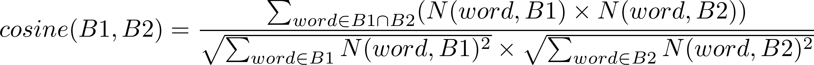

<div style="color:red;">

# **DO NOT CLONE THIS REPOSITORY BEFORE READING THE INSTRUCTIONS THOROUGHLY**

</div>


# COMP 124 Homework 6: Book Author Machine Learning

### Reports section
You will put your answers to task 5 here:

(edit the readme and place your answers here)
1. Who does the program guess the author of the book is with k=7 and a cosine similarity function? 
Answer: Jane Austen 

2. Who does the program guess the author of the book is with k=5 and a word count similairty function?
Answer: Mark Twain (Samuel Clemens)   

Any answers for extra credit reporting.

### Partner Project
You must complete this assignment with a partner. You and your partner should work using the pair programming model, 
where both of you are sitting at a single machine, side by side. (You may not split up the assignment and work on 
different parts separately! That defeats the whole purpose of having a partner.) 
One of you will be "driving," i.e., actually using the keyboard and mouse. The other one of you will 
be actively engaged (navigating, if you will): following along, providing ideas, catching and preventing bugs, etc. 
You should make sure that over the course of an assignment that you spend roughly the same amount of time each "driving."
A good way to do this might be to set a timer and trade off every 5 to 10 minutes.

Have one partner fork and clone this repo. **You only need one fork per pair of partners.**
Remember who forked the repo, as you will both need to submit this information on Moodle.

While we expect that all your primary programing will happen together, we understand that you may wish to look over the
code independently (and have access to the code during exam prep) therefore we have included instructions on how to grant
your partner access to your project repository.
**This is the only homework or lab repository where it is appropriate to use this feature of github to grant access to
other students. Only grant access to your partner for this homework.**

The student who forked the github repository can follow these steps to grant access to the repository to their partner.
1. First log into github and go to the url for your clone. 
(the URL should be something like `https://github.com/<your github username>/124-hw6`).
2. Towards the top of the page, right under the "unwatch", "star", and "fork" buttons there should be a button/link 
labeled "settings" (It has a gear icon). Click on settings.
3. On the settings page you can change a lot of settings for the repository (including some which if changed could cause 
your homework to be ungradable) Please use caution on this page. Click the "Collaborators & Teams" button on the left side
of the page.
4. You may be asked to confirm your password. You will then be presented with a page which has a space for you to add a 
team (we are using teams to manage preceptor access so you should have one team added), or add collaborators. Please add
your partner as a collaborator. To do this you will need your partners github account name.
5. At this point your partner should be able to access your github repository. They should then clone your repository. 
**Do not make a second fork**.

##### Some notes on collaborating in a shared repository:

Because you both are using the same repository you will need be cautious.
If you both try to edit the file at the same time you may get a _merge conflict_, in which two versions of the same file
exist. If this happens whoever tries to commit and push second will not be able to push.
The typical solution to this is known as "merging" however without experience merging can be confusing and deceptively
complicated.
Therefore you should avoid causing this problem at all costs, and only attempt to resolve a merge yourself if you are
sure you know what you are doing.

The easiest way to deal with a merge conflict is to not have one in the first place.
If you are following instructions and using a pair programing paradigm so long as you use one computer (or do a commit, 
push, and pull whenever you trade off computers) a merge conflict will not happen.
Failing that, we recommend a policy where you keep in communication over email and only one student attempts to edit code
at a time.
So long as both partners do not try to edit the same file at the same time you should be safe.
In the real world merge conflict are unavoidable, and in time you will have to learn how to deal with them, but this is 
not the right place or time to learn that.

If you do find yourself in a merge conflict the easiest way to fix it is for whichever student has the conflict to check
out the repository again. You can then re-make any changes you wish to make (while referencing the old code files) and make
a new commit and push it. This process isn't ideal, but it does almost always work.
 
Failing that, or if that sounds too time consuming the professors and many of the preceptors can help you manually resolve
a merge conflict. It should be noted, however, that we do not want to do this as this will only happen if you are not 
following instructions and communicating well with your partner. 

### Project description

For this homework we will be building software to predict the author of a book based only on its text.
We will be using the k-nearest-neighbors classification algorithm.
While it may sound impressive, this algorithm is pretty simple.
In the general case, the algorithm is as follows:

1. First read a large collection of data with known "labeled points" (in this case, books by authors we know). 
In our case this means that the computer will read several books from other known authors and count the words in them. 
We will use 40 books (2.5 million words) with known authors in the books folder.

2. We then need an unlabeled data point.
In our case, that means we need a book with an unknown author.
Since this is kind of rare to come by in the modern era I have provided one by taking a book and removing 
the author from the book. You could imagine this might happen if we had a book that is claimed by more than one 
potential author and we wish to use data to decide who wrote the book. 

3. Next find the k most similar labeled points to the unlabeled point.
In our case this means comparing the anonymous book to each of the 40 books with known authors, 
and returning a list of the most similar books with known author.

4. Finally, now that we have the k most similar labeled data points we can predict the 
label for our new data point as the most common label from the similar data points.
In book terms, this means that the predicted author for our anonymous book will be the most 
common author of the k most similar books with known authors.
In the simple case (k=1) this means that we would guess that a book's author is the same as 
the most similar other book we have seen.

For this project we will be using 41 e-books stored in text file format from [Project Gutenberg](https://www.gutenberg.org/).
There are many well known books and authors that are old enough that they are no longer subject to copyright.
Project Gutenburg is an online project that takes these books and creates free e-books in a variety of formats.
I have downloaded 41 of these books into the books folder.
40 of these books are presented exactly as they are on the Project Gutenburg website, the last has had its author removed.
To make this easier I have selected books from only 3 authors, however, given a larger collection of books this algorithm 
could work for a potentially limitless number of authors. 

### Task 0: Inspecting the provided files

Look over the provided files. 
What should be provided is 41 books in the "books" folder, a complete `Book` class, A complete a `SimilarityMethod` 
interface, an incomplete `AuthorGuesser` class and a `BookTest` test class.
Start by running the tests. (Not only is this good advice in general, but its a great way to make sure intellj 
is set up correctly for this homework.)
The `BookTest` should pass as we have given you a complete implementation of the `Book` class.
If this doesn't happen please contact the teaching staff so we can figure out what is wrong.

**Note** Due to the design of the assignment. `BookTest` is the only test we can give you.
That does not, however, mean that it is the only test that can be written for this assignment.
You should write your own tests to be sure your code works correctly as you write it!

Next, you should take a look at several of the book files. 
For various reasons the book text files are not just a direct listing of all text in the books. They contain some other information.
Try to understand how these ebooks are structured. Knowing this will help you if you want to use custom book files to help test
your code.

Before you continue, you should answer the following questions on moodle. 
Answers to these questions will be **due on Friday, December 7th**. 
You should work and discuss with your partner, but submit individual answers in your own words on moodle.

0. Who is your partner?(Every year we get creative spellings. Just ask your partner how to spell their name. It avoids confusion for everyone.)
1. What is the github username of the partner who cloned the repository?
2. In your own words, describe the steps the computer is going to use to guess the author of a book.
3. Describe the `Book` class, its instance variables, and its constructor. What does its constructor do?
4. Describe the `AuthorGuesser` class.

**Read through the rest of the homework assignment before answering questions 5 - 8**


5. Describe the `SimilarityMethod` interface, how will this get used, and what instances of it might you make?
6. What other classes do you intend to create (beyond the three classes provided)? A good solution will need at least three
more classes. Briefly describe each of these classes, including what interfaces do they need to implement, what instance variables
would they need to have, and are there any important methods to consider?
7. What other methods do you plan to write for `AuthorGuesser`? While its possible to implement the algorithm
 using only the methods provided, it will be nearly impossible for you to test and debug. Use method decomposition to 
 reduce the algorithm into a few smaller functions so that no one function will be too long.
8. Read through the rest of the homework, is anything currently unclear to you about this assignment?

### Task 1 Calculating how similar two items are

The core of the algorithm you will be implementing is the ability to compute how similar (or dissimilar) two books are 
to each other. We will be doing this based on the book word counts.
Therefore we need to implement what’s referred to as a “similarity function”. 
A similarity function is a function that takes two objects (two books) and returns a number, the larger the number, the 
more similar the two books are. Before looking implementing the two similarity function approaches described below, look 
carefully at the `SimilarityMethod` interface. Find in the code we have given you where this interface is used, and discuss 
with your partner why this usage of interface polymorphism is useful.

##### Word co-occurrence

The most simple approach to detecting if two books are similar is to compute how many words are shared between those two books.
Therefore our first similarity function is going to be simply the count of how many words are in common between both books.
Note, since the words will be stored in a map associated with each book, you will need to iterate
over the map's key set.

##### Cosine similarity

A much more advanced algorithm should take in account how often each word shows up in a book.
Two books should be considered similar not only for using the same words, but using them at the same rate.
One common metric that achieves this is the so-called cosine similarity.

If N(word, book) is the number of times the word appears in the book then the cosine similarity is:


Where the sum in the numerator is over words in both books.

You can compute this in three parts: S1, S2, S3 using the following pseudo-code
```
S1 = 0
S2 = 0
S3 = 0
for word in book1 :
    if word in book2:
        S1 = S1 + N(word, book1) * N(word, book2)
for word in book1:
    S2 = S2 + N(word, book1)^2
for word in book2:
    S3 = S3 + N(word, book2)^2
return S1/(sqrt(S2)*sqrt(S3))
```

### Task 2 Setting up for Task 3

Task three is going to be implementing a method to get the k nearest neighbors. 
Before we can implement that method, however, you will need to build a few more things.

 * For the k nearest neighbors algorithm you will want an object that can store a book and its similarity 
 score to the anonymous book, and can be sorted based on this similarity score.
 Having this class will make finding the k most similar neighbors of the book much easier.
   
 * We have provided you with a class named `AuthorGuesser` which is ultimately responsible for guessing the author of an 
unknown book.
 While this (guessing authors) may sound like it only needs to be a method, remember, that this method will need access to a
 large library of books with known authors, and therefore does have object state.
 We have provided the beginnings of an `AuthorGuesser` class which contains an array of book file names, a helpful method,
 and some empty functions.
 Finish the constructor of this object. It will need to create `Book` objects for each of the 40 known author books.
 You will want to store these in some sort of collection.

### Task 3 K Nearest Neighbors.

Write a method on your `AuthorGuesser` class to compute the k nearest neighbors.
There are a lot of algorithms you could choose here.
However, your implementation should use the following efficient method, which uses a min-heap to find the k (for any k) largest things 
in a list of things.
In java you can use the `PriorityQueue` class as an implementation of the min-heap.
 
The heart of this method will be a loop over all known Books computing the similarity between that book and the anonymous book.
We will keep the promise that the min-heap will always have the k most similar books we have seen so far (those with the largest similarity).
Since the `PriorityQueue` object expects to be storing objects that implement comparable, you will need a custom class
to store books sorted by similarity scores. 
You should have made this in the last step.
 
For each book, first compute the similarity with the anonymous book.
If the min heap has fewer than k things in it you can safely add this new book to it (if you have only seen 3 books, 
all three are in the group of the smallest 5 books you have seen).
However, if the min heap has k things in it you will need to get (without removing) the least similar item from the min-heap.
If sorting is done based on the similarity score, this should be no problem.
If the current book is more similar than the k least similar book we have seen so far, then we should remove that book 
from the min-heap and add this new book to it.
In this way we are still keeping our promise: we found a more similar book so we remove the least similar one we were 
remembering and kept the next one.
 
After doing this for every book we can then get the k most similar books by simply removing every remaining book from 
the min-heap.
The min-heap will have k books which should be the k most similar books.
To work with the code we have provided you will have to take these items out of the heap and add them to a list. 

### Task 4 Complete The Programming

You now should have everything you need to write a program that takes a book with no known author, and guess its author.
Your method to do this should get the k most similar books.
Then it should figure out which author appears most in that list of books.
You should be able to do this programing with very few lines of code as you only need to connect already built methods
together.

As you implement the methods in `AuthorGuesser`, you should make sure that your code for the recognition method and any decomposed 
methods that you write can be called repeatedly without breaking. This means correctly using local variables rather than instance variables 
where possible, and making sure to clear any existing state for the current recognition results from instance variables before the methods 
return so that the recognition process for the next book starts from a clean state.

As mentioned previously, you should write additional tests for the new classes/methods that you add as you practice decomposition. 
To help you with this, I am giving you the following correct results:

If you test the anon.txt file against the 74-0.txt file (The Adventures of Tom Sawyer by Mark Twain), you should get the 
following similarity values:

| Similarity Metric | Value |
|--- | --- |
| Cosine Similarity | 0.90977 |
| Word Match Similarity | 3433.0 |
 
You can also visually test your kNN methods by printing the list of closest matches and comparing them to the following 
results, using k=5 and testing with the 74-0.txt file. To get the results ordered as shown below, you will need to sort the matches 
based on the similarity score. As you should expect, the book's closest match is to itself!

```
Actual: The Adventures of Tom Sawyer, Complete by Mark Twain (Samuel Clemens)
   -------------------------------------------------
   Cosine Similarity:
   0. The Adventures of Tom Sawyer, Complete by Mark Twain (Samuel Clemens)......... 1.0
   1. A Double Barrelled Detective Story by Mark Twain (Samuel Clemens)......... 0.9744154696937292
   2. The Gilded Age, Complete by Mark Twain (Samuel Clemens)......... 0.9742866488438108
   3. The American Claimant by Mark Twain (Samuel Clemens)......... 0.9731765489098825
   4. Roughing It by Mark Twain (Samuel Clemens)......... 0.9699600133324862
   -------------------------------------------------
   Word Count Similarity:
   0. The Adventures of Tom Sawyer, Complete by Mark Twain (Samuel Clemens)......... 8288.0
   1. Roughing It by Mark Twain (Samuel Clemens)......... 5199.0
   2. The Innocents Abroad by Mark Twain (Samuel Clemens)......... 5130.0
   3. A Tramp Abroad by Mark Twain (Samuel Clemens)......... 4972.0
   4. Following the Equator, Complete by Mark Twain (Samuel Clemens)......... 4950.0
```

### Task 5 Reporting

At this point you should be able to answer the questions listed at the top of this readme. Edit the file README.md file to add your answers.

### Submission:

Since you worked with a partner, I need to know who so that I can give you credit. Please right-click the 124-hw6 module in Intellij.
Select new->file and enter the name as "partner-assignment.txt". In the text document add both of your names. Make sure the file is added to git (it should show up in green)!

Make sure to commit and push, then check on github that everything is uploaded correctly.

As always, please make sure to follow the guidelines for [good java style](https://docs.google.com/a/macalester.edu/document/d/1YpCzhKhYy5JUQ6oCGJZdf92a0jjpmjMxfKfhPkFl5As/edit?usp=sharing) that we have shared with you in the past.

### Task 6 Experiment (extra credit)
Task 6 is included for those who found this project particularly interesting.
This project implements a basic machine learning application.
However, while the programming is complete, the development of a machine learning algorithm is not!
A proper machine learning process does not stop at programming an algorithm, as you often have to _tune_ these algorithms.
Algorithm tuning means experimenting with different settings to see which one makes the best guesses.

For part 6 I would like you to experiment with different sizes of k from 3 to 9, and different similarity functions.
If you wrote your code in a general enough way you should easily be able to ask your algorithm to guess the author of a 
book whose author you already know. Therefore you should be able to estimate how accurate your algorithm is.
**Note**, ideally you should remove the book from the list of "known author books" before doing an experiment. 
Otherwise you will find that the most similar book to the one you pass in is the book itself, which will mess with the tuning.
You can still get good results (and extra credit) without addressing this issue, but if you have the time fixing this will
make your results more realistic and accurate.

Write a program that will estimate how accurate your algorithm is with different values of k and similarity functions,
then write a short paragraph here explaining your findings. Your explanation should explain which settings are the best
and what evidence you have for that claim.
