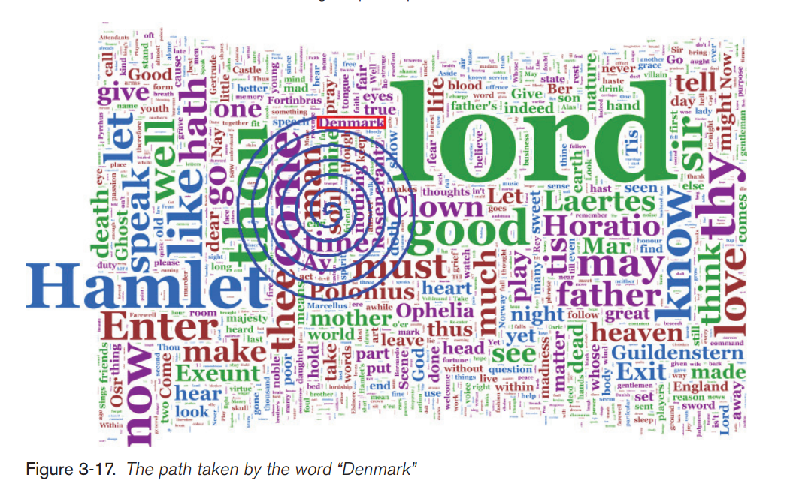

Comp 124: Word Counting Lab
============

In this lab you'll create a java object called AllWordsCounter that records
counts for individual words.

You'll apply this object to identify distinctive vocabulary for Donald Trump and Hillary Clinton
using the transcripts from their second debate.

## Part 1: Preparing

* Fork and clone this project.
* Take a look at the SingleWordCount class, (I've completed it for you).  Make sure you understand every method in the class.
* Take a look at the AllWordsCounter class (you'll be completing this class).  What's the purpose of this class?
* Run the TestSingleWordCounter to make sure your project is setup properly.

## Part 2: Complete AllWordsCounter

You need to create the array of SingleWordCounter objects, but each
entry in the array will be initially set to null. As you count new words
the array will slowly be filled with actual objects.

* Properly initialize the counters variable for the AllWordsCounter Class.
* Implement the incrementCountForWord, getNumWords, getCount, and getAllWords methods. I've given you hints.
* Make sure all the tests in AllWordsCounterTests pass.

## Part 3: Complete DistinctiveWordFinder

The class DistinctiveWordFinder identifies distinctive vocabulary in a particular document. Note that this class has
a main method defined- look at what it is doing. Then examine the code some more and look at what you need to update:

* Begin by looking carefully at the interaction of countWords and countWordsInOneFile.

Given the current main() method, what will primaryCounts and secondaryCounts contain at the end?

* In findDistinctive() you'll see two TODOs.
* Complete the findDistinctive method.

Now try running the main from DistinctiveWordFinder to make sure that it can open the files and find distinctive words. If you get errors, try to trace them by looking carefully at the error output and trace from the last error back to where you changed the code in findDistinctive().

## Part 4: Wordle Word Clouds

One way of visualizing your distinctive word results is using a word cloud in the style of [Wordle](http://www.wordle.net/). The algorithm that 
creates these types of images was created by Jonathan Feinberg.

Jonathan [describes the algorithm](http://stackoverflow.com/questions/342687/algorithm-to-implement-something-like-wordle) for Wordle in response to a question asked on StackOverflow:

> I'm the creator of Wordle. Here's how Wordle actually works:

> Count the words, throw away boring words, and sort by the count, descending. Keep the top N words for some N. Assign each word a font size proportional to its count. Generate a Java2D Shape for each word, using the Java2D API.

> Each word "wants" to be somewhere, such as "at some random x position in the vertical center". In decreasing order of frequency, do this for each word:

```
place the word where it wants to be
while it intersects any of the previously placed words
    move it one step along an ever-increasing spiral
```



* Begin by looking carefully at the WordleGLabel class (I've completed it for you.) What class does it extend? What is the purpose of this class?
* Take a look at the Wordle class. Fill in the the doLayout method using the algorithm described above.
* Don't forget to add the Glabels to your Wordle GraphicsGroup
* Now run the RunWordle class to create visualizations of the candidate speeches.

Note: word clouds are not actually very good visualizations! The size of the words doesn't take into account the length, so it is easy to make a long word seem more important.
If you are interested in lots more details on Wordles, check out the chapter from [Beautiful Visualization](http://static.mrfeinberg.com/bv_ch03.pdf).

### Attribution:

This lab was originally created by Shilad Sen. The wordle implementation was added by Bret Jackson.
